# Dife: 교환학생과 서로 교류하는 글로벌 커뮤니티

## 아키텍쳐 소개

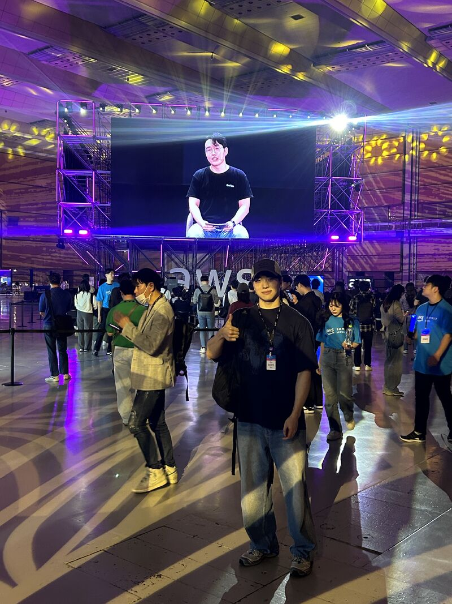

2024 AWS Summit에 참여한 사진
/ [관련 LinkedIn 포스트](https://www.linkedin.com/posts/seungholee-dev_aws-ai-saas-activity-7197907941218242560-_7Oe?utm_source=share&utm_medium=member_desktop)

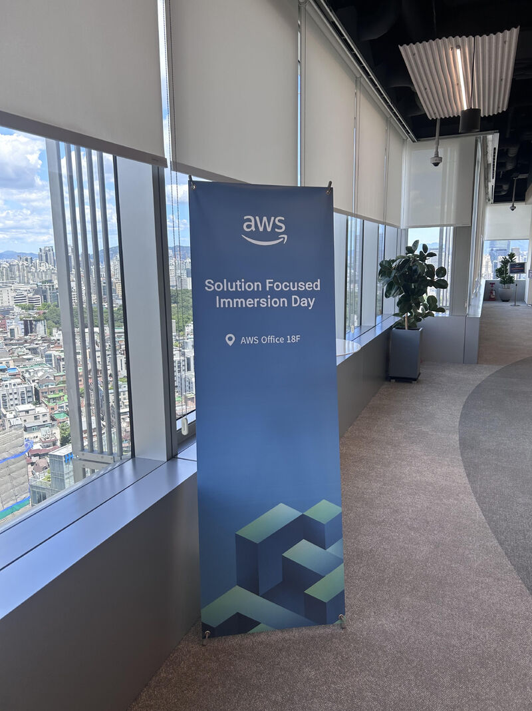

한국 아마존에서 주최한 워크숍에 참여한 사진 / [관련 LinkedIn 포스트](https://www.linkedin.com/posts/seungholee-dev_aws-eks-kubernetes-activity-7202338480037793792-9kPl?utm_source=share&utm_medium=member_desktop)

저는 좋은 소프트웨어 설계는 무엇일까 고민을 하며 성장을 꾸준히 하는 개발자입니다. Dife라는 서비스를 팀원들과 개발을 하면서 Enterprise의 입장에서 좋은 소프트웨어 설계와 개발 환경을 구축하기 위해 노력을 많이 했습니다. 

그 노력의 일환으로, AWS Summit을 포함한 여러 컨퍼런스에 참여하기도 했고, 한국 아마존에서 주최한 워크숍에도 방문하여 AWS Solution Architect분들께도 질문을 하며 고민을 해결하기도 했습니다. 

여러가지를 공부하면서 Amazon에서 공식 권장하는 Well Architecture를 따르며, enterprise 레벨에서 생각할 수 있는 보안문제, 무중단 배포, 고가용성, 확장성, 서비스 운영 비용등을 고려하여 해당 프로젝트의 클라우드 인프라를 맡아서 개발하였습니다.

설계를 하면서 주로 참고했던 사이트들은 아래와 같습니다.

- [AWS Architecture Center](https://aws.amazon.com/architecture/?cards-all.sort-by=item.additionalFields.sortDate&cards-all.sort-order=desc&awsf.content-type=*all&awsf.methodology=*all&awsf.tech-category=*all&awsf.industries=*all&awsf.business-category=*all)
- [ByteByteGo](https://blog.bytebytego.com/p/free-system-design-pdf-158-pages)
- [System Design Interview - Alex Xu](https://www.amazon.com/System-Design-Interview-insiders-Second/dp/B08CMF2CQF)
- 그 외 각종 기술 블로그 및 유튜브 참고

### AWS CDK

콘솔로 클라우드 개발을 진행하지 않고 개발 속도, 롤백 가능 여부, 버전 컨트롤, 브랜치 전략등 여러가지를 고려하여 AWS CDK를 사용하여 코드로 인프라를 구성했습니다. 
콘솔에서 변경 사항이 생길 경우 Cloudformation에서 Drift Detection 기능을 사용하여 Syncing을 진행합니다.

Cloud Repo Link: https://github.com/team-diverse/dife-cloud

### CI/CD Pipeline

Github Action을 사용하여 Backend repo에서 prod 브랜치로 배포시, Spring Boot 기반의 백엔드 Docker 이미지를 빌드하여 AWS Private ECR로 업로드 합니다. 그 다음에, ECS의 Task Definition을 변경하여 새로운 이미지로 ECS 배포를 진행합니다. 서비스에 지장이 없도록 무중단 배포를 구성하며, 배포에 문제가 있을 경우에는 이전 버전으로 롤백하도록 설정했습니다. 
추가로, 백엔드의 경우에는 Spotless 체킹과 프론트엔드는 ESLint 체킹을 통해 코드의 통일성을 높이려고 노력했습니다.

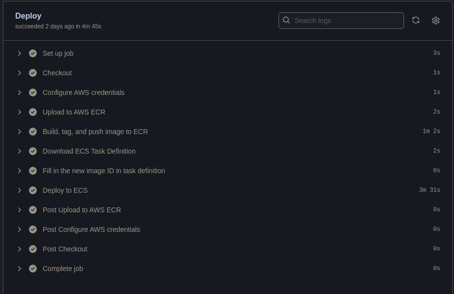

### ECS

ECS의 type으로 Serverless 방식인 Fargate가 아닌 EC2 방식을 선택하여 진행했습니다. EC2의 리소스 사용량만 높인다면 금액적으로 더 효율적인 금액이 나올 수 있었고, 직접 트래픽을 경험해보고 필요에 따라 인스턴스를 관리를 해보고자, 현재 EC2를 Container Instance으로 쓰고 있습니다. Bridge Network 모드를 사용하여, 하나의 네트워크처럼 Ingress/Egress를 관리하는 것이 쉽도록 만들었습니다.

Scale-Out policy 역시 설정이 되어있는데요, Container Instance(EC2)는 CPU or Memory 사용량의 70%가 넘으면 Scale out 하도록 설정이 되어 있으며, ECS Task (Container) 역시 CPU or Memory 사용량의 80%가 되면 Scale out이 되도록 구성되어있습니다.

Task에는 ECS Insight를 설치하여 Metric이라던지 로그를 수집합니다. EKS를 사용하지 않은 이유는, 비용의 문제도 컸고 아직은 서비스가 작기 때문에 Overkill이라고 판단되어 사용하지 않았습니다.

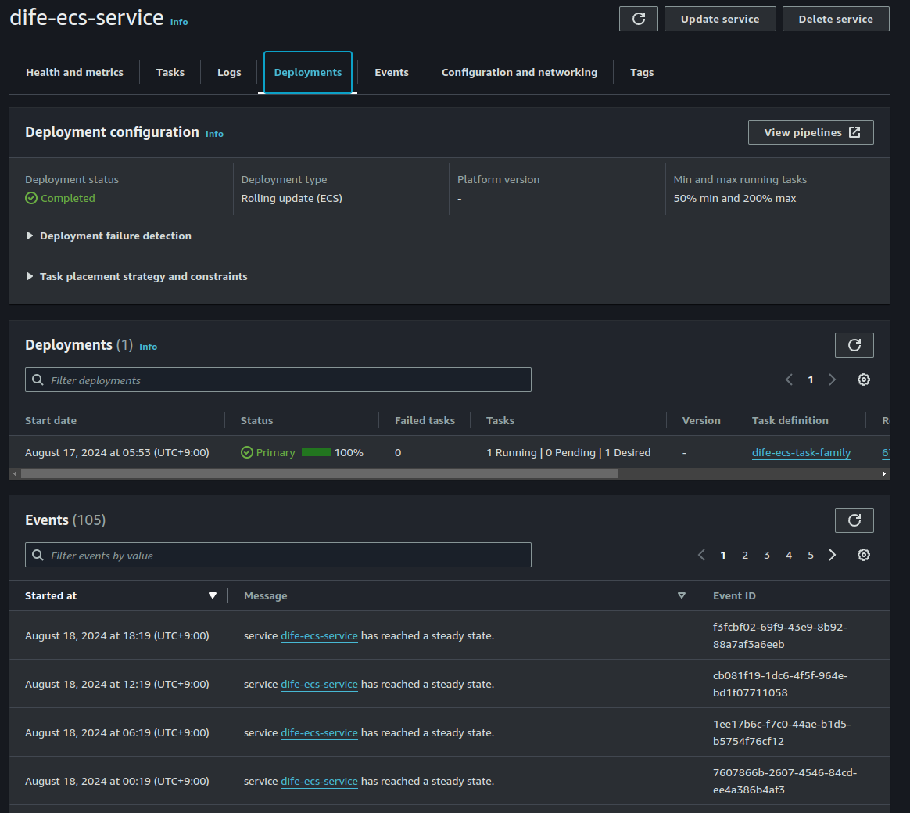

### NAT Instance
저희 서비스는 번역 API 호출과, 이메일, 알림 서비스(EXPO와 연결) 호출로 인해 VPC에서 밖으로 발생하는 트래픽이 존재합니다. 이 경우에, Public Subnet을 사용하면 문제가 없으나, 서버의 안전을 위해, Private Subnet을 활용하고 있기 때문에 외부로 나가는 NAT Gateway가 필요합니다. 하지만, 아마존에서 지원하는 NAT Gateway는 기본 요금이 월 30 USD로 저희 학생들에게는 큰 부담으로 다가왔습니다. 그래서, 각종 해외 개발자들이 직접 NAT Instance를 구성하는 모습을 보고 영감을 받아 직접 NAT Instance를 구현했습니다. 

NAT Instance를 위한 이미지를 만들기 위해 Amazon Linux 2를 기반으로 UserData Script를 작성하여 iptable을 구성했습니다. Egress하는 Network의 양이 많아진다면, Auto-Scaling Group을 적용하여 유연하게 확장할 수 있도록 구성 예정입니다.

추가로 해당 인스턴스에는 SSM으로 안전하게 접근이 가능합니다.

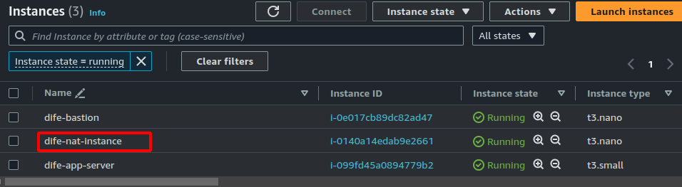

### Bastion Instance

Private Subnet에 위치한, RDS 등의 리소스를 접근하기 위해 사용하는 Jump Server입니다. 보안을 강화하기 위해 기존에 열려있는 Port 22를 닫고 AWS SSM을 통해, 안전하게 로컬에서 해당 인스턴스로 접속이 가능합니다. RDS를 접근할 때는, SSM과 터널링을 동시에 이용해서 로컬에서 PROD DB에 손쉽게 접근할 수 있습니다.

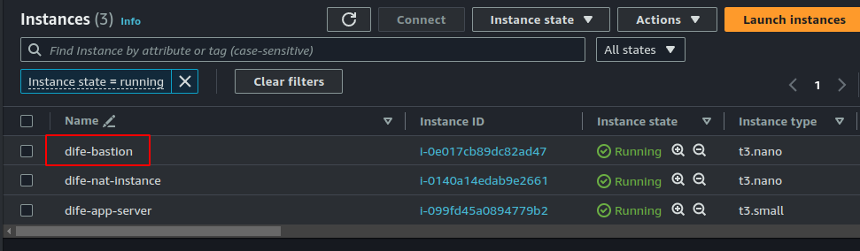

### Cloudwatch

백엔드에 문제가 생겼을 시에 쉽게 확인이 가능하도록 Dashboard를 구성하고 모니터링이 쉽게 가능하도록 구성했습니다.

백엔드로부터의 각종 로그도 확인이 가능합니다.

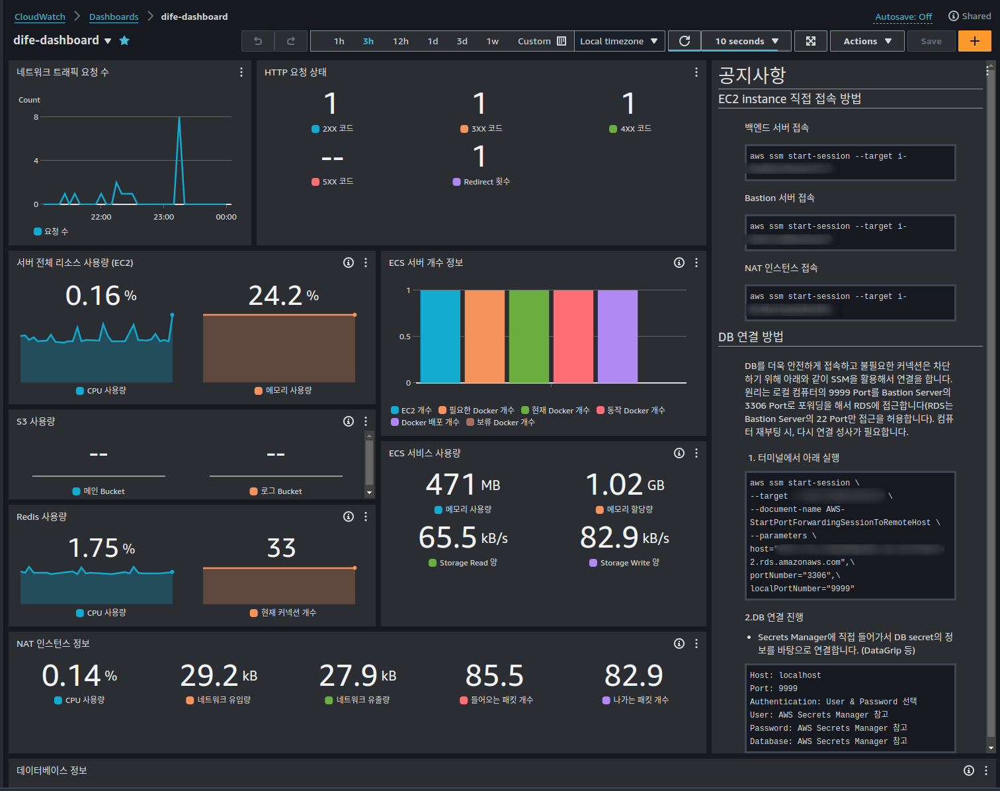
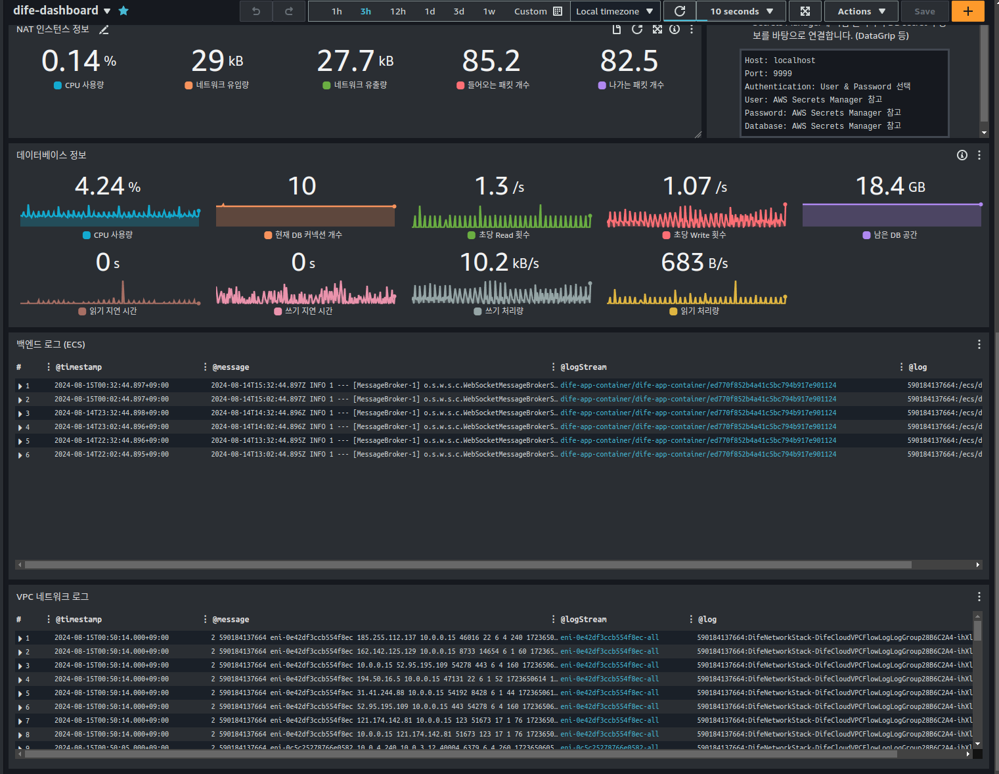

### S3 Pre-signed URL

유저가 이미지를 받아볼 때, 서버를 통해서 받아보면, 트래픽 양이 필요 이상으로 늘기도 하고, 유지 관리가 어렵습니다. 그래서, 이를 S3의 Pre-signed URL 기능을 통해, 백엔드 서버에서는 S3 파일에 대한 권한 관리만 하고 유저는 실제로 아마존의 S3에 직접 이미지/동영상 요청이 가능하도록 만들었습니다.

### JWT

Authentication/Authorization에 있어서 확장이 쉽도록 Stateless한 JWT를 활용하고 있습니다. AWS Cognito를 사용했을 수도 있지만, 비용 측면과 개발 구현의 용이성을 고려하여 Spring Security를 사용해서 유저를 DB에서 관리하고 있습니다.

JWT를 사용하면서 access-token과 refresh-token를 구별하여 토큰 갱신이 가능하도록 구현했습니다.
이를 바탕으로 프론트엔드에서는 이것을 React Native의 Expo-secure-store에 저장하여, request를 요청 시 사용합니다.

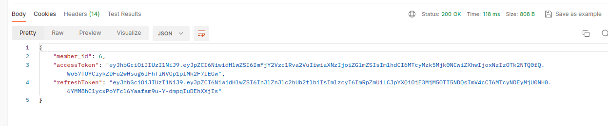

### RDS

Back-of-the-envelope 계산법을 통해 채팅과 같이 저장을 할지 그리고 비용은 어떻게 될지 고려를하고 DB에 데이터의 형식에 맞게 스키마를 구성하고 DDL을 만들었습니다.

현재 Liquibase를 통해 Migration이 가능하도록 구성 중에 있습니다.

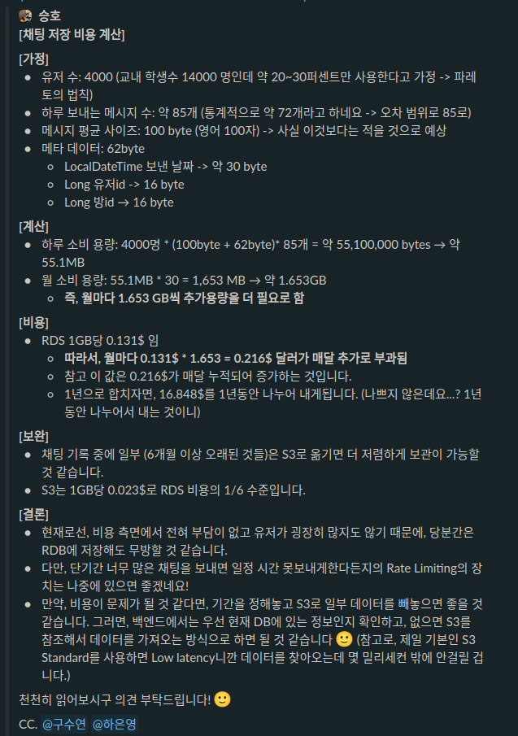

위의 메시지는, 저희가 주로 소통하는 Slack에서 과거에 채팅을 RDS에 저장하는 것이 옳을지에 대한 Back of the envelope 계산 결과입니다.

이와 같은 여러 고려사항을 고려하여 One to Many / One to One / Many to Many 관계를 필요에 따라 적절하게 구성하여 스키마를 구성했습니다.

### Redis (Elastic Cache)

Scalable한 채팅 시스템을 구성하기 위해 Redis PUB-SUB을 사용하고 있습니다.
서버가 하나일 때는, 채팅 서버의 복잡한 구성이 필요없지만, 채팅 서버가 여러개 일 때, 웹소켓이 연결된 서버끼리 소통을 하기 위해 Redis를 사용해서 뿌려주어 통신이 가능하게 합니다.
특히나, 채팅에 한해서 ALB에서 Sticky Session 기능을 활용하면, 유저와 서버의 웹소켓 연결을 유지할 수 있습니다. 로컬에서 백엔드 서버를 돌릴 때는 도커를 활용해서, 로컬에서 테스팅이 가능하도록 설정합니다.

추가로, 이 Redis를 활용하여 Race Condition에서 락을 걸 때도 활용할 예정입니다.

### ALB, Route 53, HTTPS 적용

서버를 바로 노출시키지 않기 위해 ALB를 배치했습니다. ALB는 특히나, 서버가 여러대 일때, 분산된 트래픽을 제공할 수 있기 때문에 유용합니다. 특히나, WAF를 앞에 배치하여 DOS 공격 등을 방지 할 수도 있습니다.
현재 ALB의 Target Group은 ECS로 되어있습니다. 
ACM을 활용하여 증명서를 받아 ALB에 적용했으며, ALB의 HTTP 80 Listener를 443 HTTPS로 리디렉팅을 하여, 보안을 더 안전하게 구성할 수 있었습니다.
Route 53에서 도메인을 구매하여 difeapp.com을 백엔드에 적용시켰습니다.

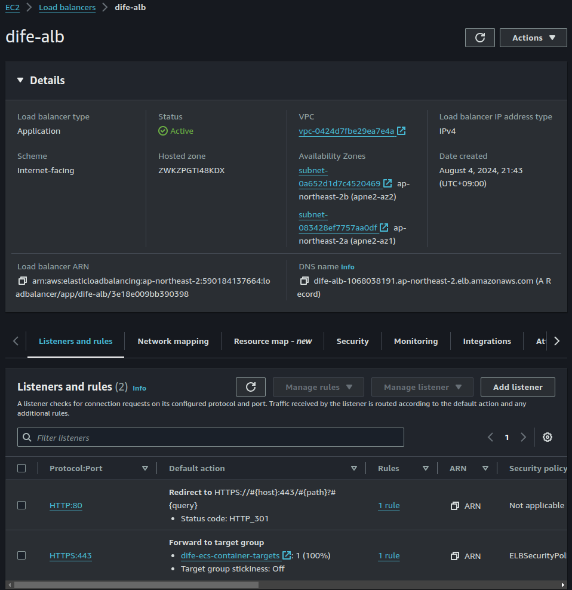

### Secrets Manager
API KEY, 환경변수 등 Github에서도 노출되면 안되는 정보는 Secret Manager로 관리를 할 수 있도록 구성하여 보안을 생각했습니다. 여기에는 JWT의 시크릿등이 포함됩니다.

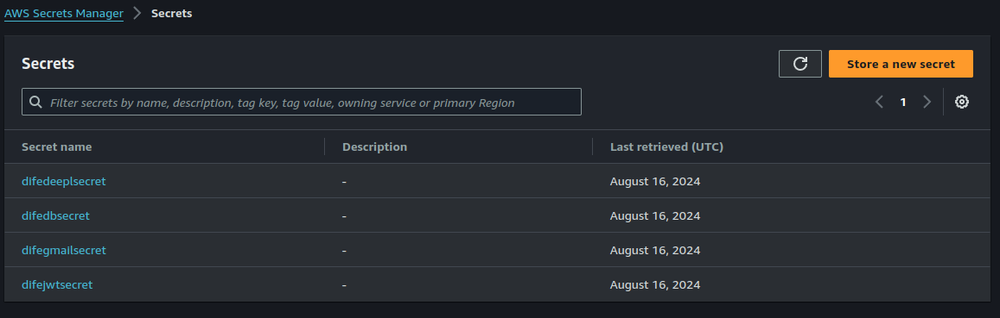

### 

## Dife 서비스 소개

### Dive into new campus life! Dife

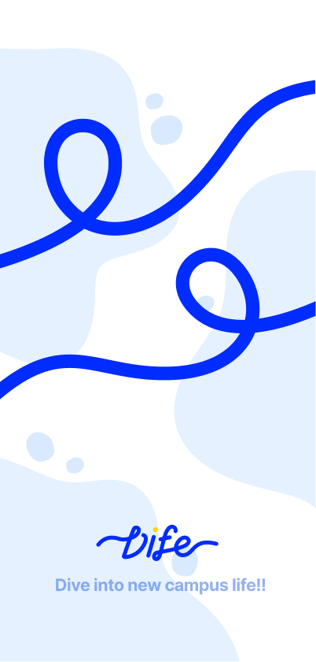

*이 Repository는 Cloud의 IaC만을 코드로 구현한 리포지토리를 Fork한 개인 리포지토리입니다.(백엔드와 프론트엔드는 별도의 Repository 참고)*

**기간: 2024.03.01 ~ 진행 중**

Dife는 외국인 교환학생들이 한국 학교 시스템과 일상생활에 원활하게 적응할 수 있도록 돕기 위한 서비스입니다. 
Dife라는 서비스를 추진하게 된 배경은, 국민대학교에서 외국인 학생이 많은 수업에 참여하고 나서, 외국인 유학생 친구들이 국민대학교 및 한국 학교에서 문화적으로 많은 불편함을 겪고 있다는 것을 알게 되었기 때문입니다. 그래서, 이를 해결하고자 Dife에서는 외국인 유학생들에게 빠르게 적응할 수 있도록 다양한 기능을 제공합니다. 

교환학생들이 한국에서 학업과 생활을 더 편리하고 즐겁게 할 수 있도록 돕는 것을 주요 목표로 합니다. 아울러 한국 학생들과 외국인 학생들이 채팅과 같이 교류를 더 쉽게 하도록 돕습니다.

많은 내국인 학생들과 외국인 학생들이 해당 어플에 관심을 가졌으며, 이를 바탕으로 초기 단계의 어플을 구성할 수 있었습니다.

### 커넥트 서비스

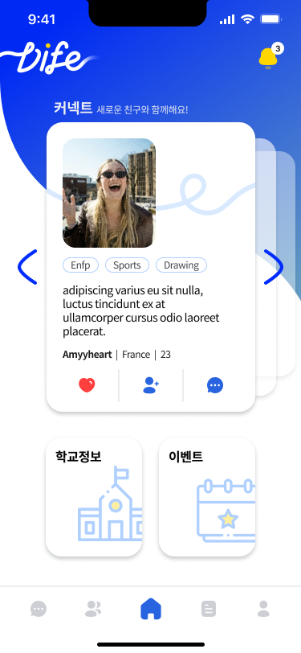

커넥트 서비스는 자기와의 관심사가 맞는 학생을 탐색하고 함께 친구를 만들 수 있는 기능입니다.

### 채팅 서비스

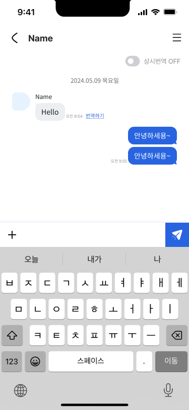

채팅 서비스는 유저들이 서로 1:1 또는 그룹으로 채팅을 할 수 있는 기능입니다.

### 번역 기능

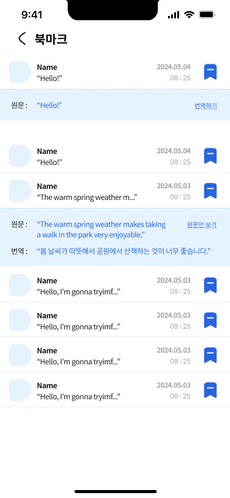

번역 기능은 서로 다른 국적의 유저들이 상대방의 언어를 쉽게 배울 수 있도록 도와주는 기능입니다.
DeepL 번역 API를 사용합니다.

### 커뮤니티 기능

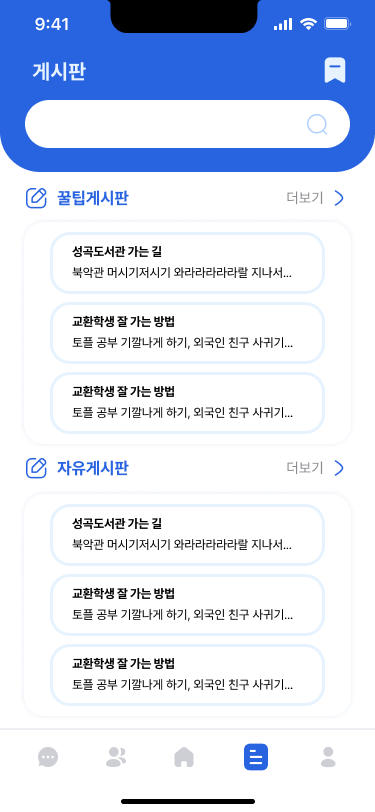

커뮤니티 기능은 학생끼리 꿀팁과 각종 자유 게시글을 공유할 수 있는 기능입니다.

## 팀원 구성
- 이승호(본인): 팀 리더 및 Fullstack 개발 
- 구수연: 백엔드 담당 개발
- 하은영: 프론트엔드 담당 개발
- 서예린: 디자인 담당 개발

## 진행 상황
현재 TestFlight에서 내부 Alpha 테스트 및 QA 진행 중

## 개발 환경

- Ubuntu 22.04
- IntelliJ, VSCode, NeoVim
- Git
- Slack
- Jira

## Git Rule

Reference

-   [A Simplified Convention for Naming Branches and Commits in Git](https://dev.to/varbsan/a-simplified-convention-for-naming-branches-and-commits-in-git-il4)

-   [Naming conventions for Git Branches — a Cheatsheet](https://medium.com/@abhay.pixolo/naming-conventions-for-git-branches-a-cheatsheet-8549feca2534)

### Commits Convention

#### Template

> git commit -m 'category(field): do something'
> git commit -m 'feat(profile): add profile picture upload'

#### prefix

-   feat: 새로운 기능 구현
-   fix: 버그 수정
-   refactor: 코드 개선 및 리팩토링
-   docs: 문서화 작업
-   chore: 비즈니스 로직과 어플리케이션 로직과 연관 없는 각종 작업들
-   style: 코드의 포맷 및 오타 수정 등
-   test: 테스트 작성
-   perf: 성능 작업
-   ci: CI 작업
-   build: 빌드 및 패키지 관리 등
-   revert: 이전 변경 사항을 되돌리는 revert

### Branches

> 로컬 브랜치는 prod로 Merge하는 것을 원칙으로 한다.

### Branch 이름 예시

> feat/T-123-new-login-system
> build/v2.0.1

#### Branch 이름

> Commit prefix와 동일

### Others

-   PR이 Merge가 되면 사용했던 브랜치는 삭제한다.
-   코드 리뷰를 위해 모든 팀원을 Reviewer 지정을 한다.
-   코드의 가독성과 손쉬운 Documentation 관리를 위해 주석은 가능하면 작성하지 않는다.
